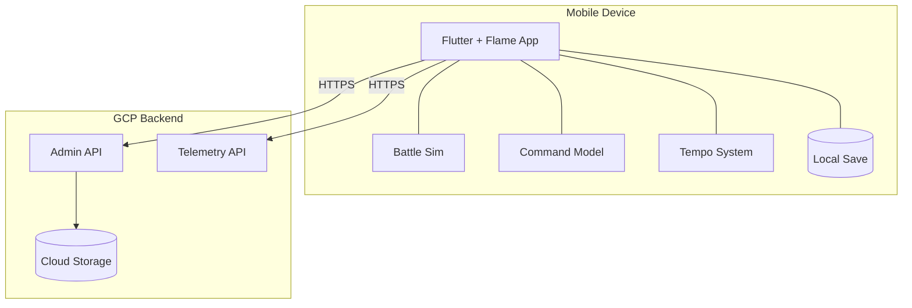
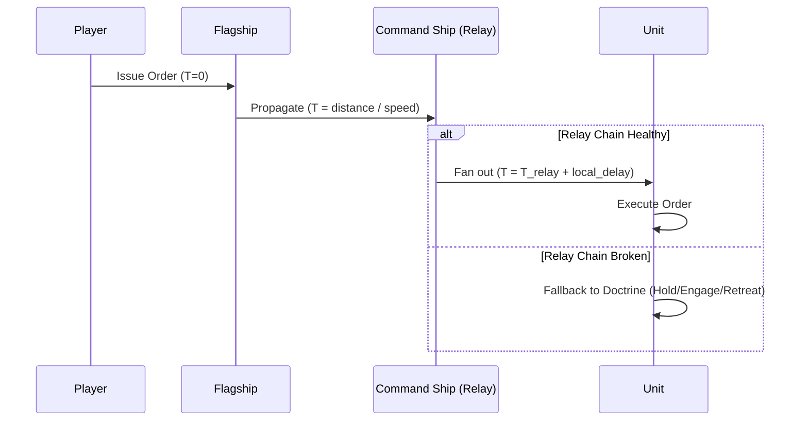
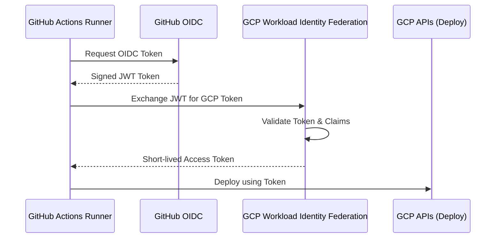
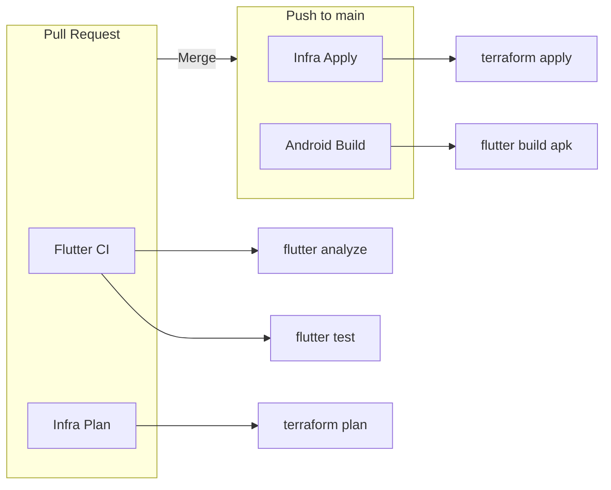

# Visual Architecture Diagrams — Drift Command

This document provides visual representations of the Drift Command architecture using Mermaid diagrams.

## 1. High-Level System Overview



## 2. Order Propagation Sequence

How orders move from the Flagship to individual units over time.



## 3. Tempo System Transitions

The game dynamically adjusts its "pulse" based on combat proximity.

```mermaid
stateDiagram-v2
    [*] --> Distant: Start
    
    Distant --> Contact: Enemy within 2x weapon range
    Contact --> Distant: All enemies beyond 2x range
    
    Contact --> Engaged: Active weapons fire
    Engaged --> Contact: Cease fire (timeout)
    
    Distant --> Engaged: Ambush / Warp-in
    Engaged --> Distant: Retreat / Warp-out

    state Distant {
        note right of Distant: Pulse: 10-20s
    }
    state Contact {
        note right of Contact: Pulse: 5-10s
    }
    state Engaged {
        note right of Engaged: Pulse: 2-5s
    }
```

## 4. GCP Authentication Flow (WIF)

Secure deployment without long-lived keys.



## 5. CI/CD Pipeline


