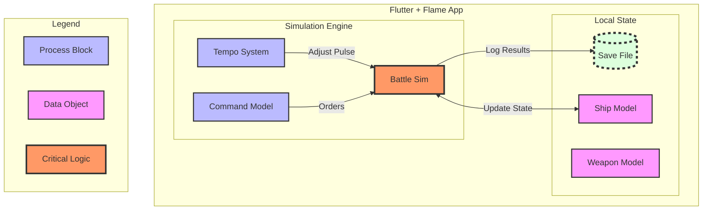

# Advanced Mermaid: The "Lucid" Style

This example uses standard Mermaid syntax but focuses on **Subgraphs** (nesting) and **ClassDefs** (CSS-like styling) to achieve a professional, Lucid-chart aesthetic.

## The Strategy: "Grouping and Styling"

Instead of just lines and boxes, we group logical clusters (like the Simulation Engine vs. the UI) into subgraphs and apply color-coded classes to distinguish between "Data," "Process," and "Storage."

### Diagram-as-Code (Mermaid Source)

### Why this is "Advanced":
1.  **Semantic Classes:** Notice `:::process` and `:::data`. You aren't just picking colors; you're defining what those boxes *mean* globally across your diagram.
2.  **Nesting (Subgraphs):** By wrapping the Core in its own box, you show the "boundary" of your simulation logic.
3.  **Visual Hierarchy:** The `critical` class uses a thicker stroke and orange fill to draw the eye immediately to the `Battle Sim`.
4.  **Dashed Borders:** The `storage` class uses `stroke-dasharray` to visually represent a "database" or "save file" differently from a standard process.

### How to use it:
You can paste this directly into any Mermaid-compatible viewer (GitHub, VS Code extension, or `beautiful-mermaid`) and it will render with these exact styles.
