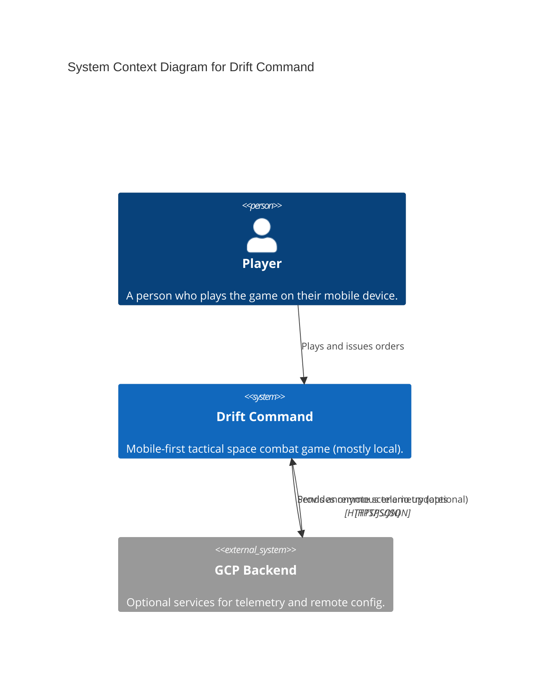
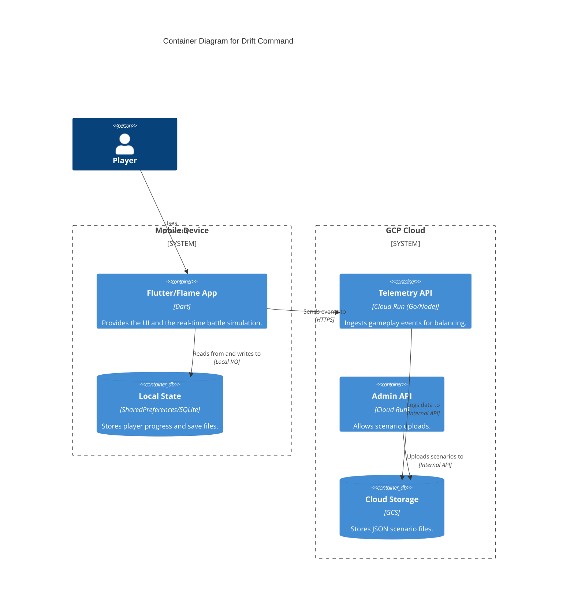

# C4 Model: Architectural Strategy

For large, complex systems, the "C4 Model" is the gold standard. It’s not just about "drawing boxes"—it’s about **layering your documentation** so that you don't overwhelm the reader.

## The Strategy: "Zooming In"

1.  **Level 1 (System Context):** High-level view for non-technical stakeholders (The User, The App, The Backend).
2.  **Level 2 (Containers):** The tech stack (Mobile App, API, Database).
3.  **Level 3 (Components):** The internal modules (Battle Sim, AI Doctrine).
4.  **Level 4 (Code):** Class diagrams (Ship Model, Weapon Model).

### Diagram-as-Code (Mermaid C4 Syntax)

### Why C4 is Crucial for Complex Systems:
1.  **Prevents Cognitive Overload:** You never try to show the "Ship Model" and the "GCP Admin API" in the same diagram. You "zoom in" to see more detail.
2.  **Standardized Vocabulary:** Everyone understands what a `Person`, `System`, `Container`, and `Component` is.
3.  **Cross-Team Communication:** Level 1 is for product managers. Level 2 is for architects. Level 3/4 is for developers.

### How to use it:
Mermaid now has **native C4 support** (using `C4Context`, `C4Container`, etc.). You can paste this directly into GitHub or any Mermaid-compatible viewer.
